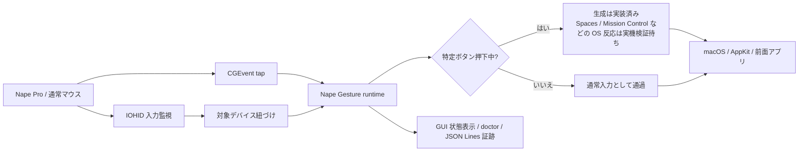
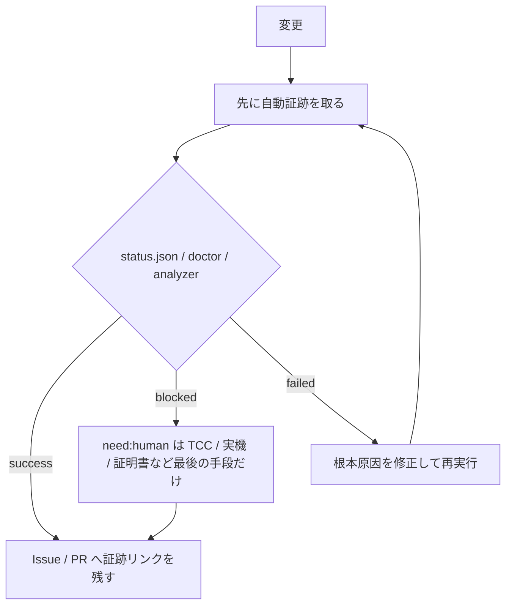

# Nape Gesture

Nape Gesture は、Nape Pro などの通常マウス入力を macOS 上でトラックパッド級のジェスチャー操作へ変換する常駐 GUI アプリです。
特定ボタンを押している間だけジェスチャーモードへ入り、押していないときは通常のマウスとして振る舞います。

Mac Mouse Fix のコード、定数、状態遷移、係数は流用しません。公開 API と、このリポジトリで取得した実機ログから独自に挙動を作ります。

## いまの完成状態

| 項目 | 実装・検証状態 | 確認先 |
| --- | --- | --- |
| 通常 GUI アプリ | 実装済み。`.app` identity、通常 GUI 設定、AppKit `gui-smoke`、computer-use による設定ウィンドウ表示、System Events による Dock item 観測は確認済み | `bundle-app` / `verify-bundle` / `gui-smoke`、[ADR-0024](docs/adr/0024-regular-gui-app-launch.md) |
| メニューバー常駐 UI | 実装済み。AppKit `gui-smoke` で status item `NG`、状態、開始、緊急停止、停止、設定、権限導線の生成契約を検査する。SystemUIServer の AX name に出ない場合は `gui-smoke` を正とする | [docs/completion-checklist.md](docs/completion-checklist.md) |
| 設定 UI | 実装済み。編集項目 catalog、JSON round-trip、computer-use による `.app` 設定表示と保存操作は確認済み。保存は設定ファイル更新までの証跡で、TCC 許可済み runtime と実イベントは completion matrix で管理する | [ADR-0021](docs/adr/0021-settings-ui-field-catalog.md)、[docs/completion-checklist.md](docs/completion-checklist.md) |
| Runtime event | `.build/NapeGesture.app` の TCC 許可済み経路で成功。gesture-drag / gesture-wheel / kill-switch / gesture-wheel-then-kill-switch / normal-after-release を `scripts/collect-runtime-event-evidence.sh` で機械判定した | [ADR-0032](docs/adr/0032-reference-target-foreground-capture.md)、[ADR-0033](docs/adr/0033-kill-switch-pending-release-suppression.md) |
| 通常入力通過 | 機械証跡あり。ジェスチャーボタン未押下時と解放後の通常クリック、ドラッグ、ホイールを AppKit target log で確認する | [ADR-0016](docs/adr/0016-normal-input-kind-assertions.md) |
| 権限導線 | 実装済み。GUI と `doctor` が TCC 権限付与対象を表示し、System Settings を開く | [ADR-0020](docs/adr/0020-doctor-tcc-permission-target.md)、[ADR-0025](docs/adr/0025-gui-permission-recovery-actions.md) |
| runtime 性能測定 | tap callback から投稿直前/直後までを JSON Lines で保存し、p95 / p99 を判定できる | [docs/performance-baseline.md](docs/performance-baseline.md) |
| 実機完成判定 | 一部は人間作業待ち。純正トラックパッド操作、Nape Pro 実機操作、公証は自動化できない最後の手段として扱う。TCC 許可済み runtime event は機械証跡取得済み | [docs/completion-checklist.md](docs/completion-checklist.md) |
| 署名・公証済みリリース | 未完了。Developer ID 署名、公証、stapler / Gatekeeper 評価の証跡が必要 | [docs/release.md](docs/release.md) |

`need:human` はレビュー待ちや判断待ちではなく、人間が実際に作業しないと進められない TCC 操作、物理デバイス操作、証明書操作などにだけ使います。
自動化できる検証は先に自動化し、人間作業は最後の手段に限定します。

## 全体像



この図は入力経路と責務の全体像です。
Spaces / Mission Control など、OS 側の画面反応を最終完成扱いにするには、[docs/completion-checklist.md](docs/completion-checklist.md) の実機証跡が必要です。

## 使い始める

### GUI アプリとして起動する

開発中に直接起動する場合:

```sh
swift run nape-gesture app
```

`.app` として起動する場合:

```sh
swift build -c release
.build/release/nape-gesture bundle-app --out .build/NapeGesture.app --replace
.build/release/nape-gesture verify-bundle .build/NapeGesture.app
open .build/NapeGesture.app
```

作成した `.build/NapeGesture.app` は、通常 GUI アプリとして Dock に表示され、起動時に設定ウィンドウを開きます。
2026-07-10 の main `24f0f7f` では computer-use と System Events により、`.build/NapeGesture.app` の frontmost / running、`Nape Gesture 設定` ウィンドウ、主要 UI 要素、Dock item `NapeGesture` を確認済みです。
2026-07-09 の main `f43e217` では computer-use により、`保存して再起動` の押下と設定ファイル更新、通常アプリメニューの権限導線を確認済みです。
この権限導線確認は System Settings へ進む前の UI 確認であり、TCC 許可そのものではありません。
`gui-smoke --json --assert` は runtime を開始せずに、active macOS GUI session 上の AppKit 内で `.regular` activation policy、設定ウィンドウ、status item `NG`、通常アプリメニュー、status menu の生成契約を機械検査します。
SystemUIServer の Accessibility name に status item が出ない場合でも、この `gui-smoke` の AppKit 証跡を status item 生成契約の正とします。
TCC 許可済み runtime の証跡は [docs/completion-checklist.md](docs/completion-checklist.md) で管理します。
常駐状態の開始、停止、設定、権限確認はメニューバーの `NG` から操作できます。
アクセシビリティと入力監視の許可は、実利用する `NapeGesture.app` に対して付与してください。bundle ID は `dev.char5742.nape-gesture` です。

初回起動で詰まりやすい順序:

1. `.build/NapeGesture.app` を作成して `open .build/NapeGesture.app` で起動する
2. 設定ウィンドウまたは `init-config` で対象デバイス条件を保存する
3. `NG` またはアプリメニューから「権限とデバイスを確認」を開く
4. System Settings で `NapeGesture.app` にアクセシビリティと入力監視を許可する
5. Nape Gesture を再起動する
6. `NG` メニューから常駐処理を開始し、`doctor --json` の `runtimeIdentity` と許可対象が一致していることを確認する

対象デバイス一致が必須のまま条件が空の場合、`app` と `run` は全デバイスへ誤適用しないよう開始前に停止します。

### 権限とデバイスを確認する

```sh
swift run nape-gesture doctor --probe-hid --benchmark-events 50000 --json --assert-runtime-ready
```

GUI では、メニューバーの `NG` またはアプリメニューから「権限とデバイスを確認」を開きます。
未許可または未判定の場合は「アクセシビリティ設定を開く」「入力監視設定を開く」から System Settings の該当画面を開き、許可後に Nape Gesture を再起動してください。

`doctor --json` には実行ファイル、bundle ID、bundle path などの `runtimeIdentity` と、TCC 権限付与対象を構造化した `tccStatus.permissionTarget` が含まれます。
権限が未許可のときは、この値でどの `.app` または実行ファイルを許可すべきか確認します。

`run` と `log` はグローバル入力を扱うため、アクセシビリティ権限が必要です。
`check-config --probe-hid` または対象デバイス設定つきの `run` は IOHID 入力を読むため、入力監視権限も必要です。
`log` は `--duration <秒>` で自動停止、`--out <path>` で JSON Lines を保存します。
開始・終了などのメタ情報は標準エラーに出し、イベント本体だけを標準出力または `--out` に出します。
`--exclude-generated` は純正入力や実デバイス入力だけ、`--only-generated` は Nape Gesture が生成したイベントだけを記録します。

### 設定ファイルを作る

```sh
swift run nape-gesture init-config --out nape-gesture.config.json
swift run nape-gesture init-config --vendor-id <ID> --product-id <ID> --usage-page <ID> --usage <ID> --association-window 0.12 --out nape-gesture.config.json
```

`run`、`check-config`、`app` は `--config` を省略した場合、`~/Library/Application Support/NapeGesture/config.json` を使います。
存在しない場合は Nape Pro 向けテンプレートを作成します。
対象デバイス一致が必須のまま対象条件が空の場合は、全デバイスへ誤適用しないよう起動前に停止します。

## GUI でできること

- 設定ウィンドウで activation button、感度、方向ロック、加速度、慣性、キャンセル条件、対象デバイス、対象入力の紐づけ秒、主要ジェスチャー割り当てを編集する
- メニューバー常駐 UI から runtime を開始、停止、再開する
- 権限付与対象、アクセシビリティ状態、入力監視状態、実行ファイル、bundle ID、HID デバイス数、対象一致数を確認する
- アクセシビリティまたは入力監視の System Settings 画面を開く
- 対象デバイス未検出、実行中のデバイス消失、権限未許可、スリープ復帰後の停止を検出し、手動停止するまで 5 秒間隔で自動再試行する

アプリごとの有効・無効、感度、割り当ては持ちません。
特定ボタンを押していない状態では通常マウスとして振る舞うため、アプリ別に通常入力へ戻す設定は不要です。

## コマンドの使い分け

| コマンド | 用途 |
| --- | --- |
| `app` | 通常 GUI アプリモードで起動する |
| `gui-smoke` | runtime を開始せずに通常 GUI activation policy、設定ウィンドウ、status item `NG`、通常アプリメニュー、status menu を JSON で検査する。`--config` 未指定時は一時 config を使う |
| `run` | グローバルイベントタップで入力を読み、生成イベントを投稿する |
| `doctor` | 権限、対象デバイス、HID probe、runtime ready、benchmark を一括診断する |
| `devices` | IOHID で認識できるマウス系または全 HID デバイスを一覧する |
| `hid-log` / `analyze-hid-log` | Nape Pro などの HID 生入力を記録、解析する |
| `log` / `analyze-log` / `compare-log` | 実デバイス、純正トラックパッド、生成イベントを JSON Lines で記録、解析、比較する |
| `target` / `analyze-target-log` | AppKit が受け取った `scrollWheel` / `swipe` / `magnify` などを画面と JSON Lines で確認する。無人証跡では `--focus-capture-point` で capture view 中心へカーソルを移動し、`--assert-has-foreground-capture` で `globalMonitor` だけの弱い証跡を除外する |
| `system-test` | Spaces、Mission Control、横スクロール、キルスイッチなどのシナリオを dry-run または実行する |
| `benchmark` | 認識器とスクロール計画の純粋ロジック処理時間を測る |
| `analyze-performance-log` | runtime 性能 JSON Lines から tap-to-post の p95 / p99 を判定する |
| `sample-cpu` | runtime など任意 PID の CPU 使用率を周期サンプルし、idle / active / recovery の基準を JSON と終了コードで判定する |
| `bundle-app` / `verify-bundle` | `.app` を作成し、Info.plist、署名、同梱物、通常 GUI 設定を検証する |

`system-test --post-to-pid` は Reference Target App の sink 診断専用です。
完成証跡では `.cghidEventTap` 経由の `system-test` と `analyze-target-log --assert-has-foreground-capture` を使います。
`system-test run --scenario kill-switch` は未マークの `Control + Option + Command + G` を interval 付きの `keyDown` / `keyUp` として投稿し、daemon 停止ログと target log 漏れなしを確認します。

<details>
<summary>CLI 例を開く</summary>

```sh
swift run nape-gesture help
swift run nape-gesture devices
swift run nape-gesture devices --all --json
swift run nape-gesture check-config
swift run nape-gesture check-config --probe-hid

swift run nape-gesture hid-log --duration 10
swift run nape-gesture hid-log --vendor-id <ID> --product-id <ID> --usage-page <ID> --usage <ID> --duration 10
swift run nape-gesture analyze-hid-log Fixtures/sample-hid-log.jsonl

swift run nape-gesture log
swift run nape-gesture log --duration 8 --out trackpad-space-right.jsonl --exclude-generated
swift run nape-gesture analyze-log Fixtures/sample-log.jsonl
swift run nape-gesture compare-log Fixtures/sample-trackpad-scroll-log.jsonl Fixtures/sample-generated-scroll-log.jsonl

swift run nape-gesture target
swift run nape-gesture target --out target-events.jsonl
swift run nape-gesture target --out target-events.jsonl --duration 8 --ready-file target.ready.json --focus-capture-point
swift run nape-gesture analyze-target-log Fixtures/sample-target-log.jsonl
swift run nape-gesture analyze-target-log Fixtures/clean-target-log.jsonl --json --assert-no-leaks --assert-has-generated-event
swift run nape-gesture analyze-target-log Fixtures/normal-input-target-log.jsonl --json --assert-has-unmarked-input
swift run nape-gesture analyze-target-log Fixtures/gesture-target-log.jsonl --json --assert-has-gesture

swift run nape-gesture analyze-association Fixtures/sample-association-hid-log.jsonl Fixtures/sample-association-event-log.jsonl --window 0.12
swift run nape-gesture analyze-association Fixtures/sample-association-hid-log.jsonl Fixtures/clean-association-event-log.jsonl --window 0.12 --json --assert-valid-window

swift run nape-gesture derive-parameters Fixtures/sample-tuning-trackpad-log.jsonl --json --assert-complete
swift run nape-gesture generate-scroll --x 0 --y -480 --steps 24
swift run nape-gesture generate-scroll --x 0 --y -480 --steps 24 --momentum-steps 12 --dry-run
swift run nape-gesture generate-scroll --x 0 --y -480 --steps 24 --momentum-steps 12 --dry-run --log-json > generated-scroll.jsonl
swift run nape-gesture generate-scroll --x 1200 --y 0 --steps 30 --mode space-right --phase auto --dry-run --json

swift run nape-gesture system-test list
swift run nape-gesture system-test run --scenario space-left --target finder --dry-run
swift run nape-gesture system-test run --scenario space-left --target finder --dry-run --log-json --out system-space-left.jsonl
swift run nape-gesture system-test run --scenario horizontal-scroll --dry-run --log-json --out system-horizontal-scroll.jsonl
swift run nape-gesture system-test run --scenario normal-after-release --post-to-pid <Reference Target App PID>
swift run nape-gesture analyze-log system-horizontal-scroll.jsonl --json

swift run nape-gesture benchmark --events 200000 --json
swift run nape-gesture doctor --probe-hid --benchmark-events 50000 --json --assert-runtime-ready
swift run nape-gesture run
swift run nape-gesture run --performance-log runtime-performance.jsonl
swift run nape-gesture analyze-performance-log runtime-performance.jsonl --json --assert-baseline
swift run nape-gesture sample-cpu --pid <nape-gesture PID> --duration 30 --interval 1 --mode idle --json --assert-baseline

swift run nape-gesture bundle-app --out .build/NapeGesture.app --replace
swift run nape-gesture verify-bundle .build/NapeGesture.app
swift run nape-gesture-core-tests
```

</details>

## 設定と安全性

設定ファイルは起動前に検証されます。
感度、加速度、慣性、キャンセル条件、対象入力の紐づけ秒、対象デバイス条件に不正値がある場合、`run` と `check-config` は開始せず、`doctor --json` は `settingsValidationIssues` に問題箇所を出します。

`targetDeviceAssociation.associationWindow` は、対象 HID 入力の直近時刻とイベントタップ入力を同一入力として扱う秒数です。
デフォルトは `0.12` 秒です。
短くすると対象外デバイスを巻き込みにくくなりますが、イベントタップ側の到達が遅い環境では Nape Pro 入力を取りこぼす可能性があります。
長くすると取りこぼしに強くなる一方、別デバイス入力を誤って紐づけるリスクが上がります。

`gesture.acceleration.isEnabled` は速度に応じた加速度倍率を有効化します。
`thresholdVelocity` を超えた速度から倍率が上がり、`exponent` でカーブ、`maximumMultiplier` で最大倍率を調整します。
デフォルトでは無効です。

`gesture.momentum.isEnabled` はボタン解放後の慣性を有効化します。
`minimumStartVelocity` で慣性開始速度、`stopVelocity` で終了速度、`decayPerSecond` で 1 秒あたりの減衰率、`frameInterval` で生成間隔を調整します。

`gesture.cancellation.maximumDuration` はジェスチャー全体の最大秒数、`maximumInactivityInterval` は入力が途切れたときにキャンセルする秒数、`offAxisCancelRatio` は方向ロック後に直交方向へ逸れたときのキャンセル比です。
各値は `0` で無効化できます。

誤爆や暴走を感じた場合は `Control + Option + Command + G` を押してください。
ジェスチャー生成と慣性を即座に停止し、再開は常駐 UI の停止/開始またはプロセス再起動で行います。
発火後も通常クリック、ドラッグ、ホイールを勝手に抑制し続けません。

## Nape Pro を識別する

Nape Pro が通常の `devices` に出ない場合は、`devices --all --json` で全 HID デバイスを確認します。
JSON には `stableID`、`vendorID`、`productID`、`primaryUsagePage`、`primaryUsage` が含まれます。

対象らしい値が見つかったら、次のように Nape Pro を操作しながら HID 入力を記録します。

```sh
swift run nape-gesture hid-log --vendor-id <ID> --product-id <ID> --usage-page <ID> --usage <ID> --duration 10 --out nape-pro-hid.jsonl
swift run nape-gesture analyze-hid-log nape-pro-hid.jsonl
```

取得した値は `init-config --vendor-id <ID> --product-id <ID> --usage-page <ID> --usage <ID> --association-window <秒> --out <path>` で設定ファイルへ反映できます。
必要なら `--manufacturer-contains`、`--product-contains`、`--transport-contains` も併用できます。
設定 UI でも vendor ID、product ID、usagePage、usage、対象入力の紐づけ秒などを編集できます。

## アプリバンドルと配布

`.app` として使う場合は、先に release build を作成してからバンドル化します。

```sh
swift build -c release
.build/release/nape-gesture bundle-app --out .build/NapeGesture.app --replace
.build/release/nape-gesture verify-bundle .build/NapeGesture.app
```

`bundle-app` は `Info.plist`、実行ファイル、`LICENSE.txt`、`THIRD_PARTY_NOTICES.md` を含む `.app` を作成し、作成直後に同じ検証を実行します。
`verify-bundle` は既存の `.app` を再検証するためのコマンドで、通常 GUI アプリとして使うための `LSUIElement=false` とコード署名状態も表示します。
公開配布前は `verify-bundle --require-signature .build/NapeGesture.app` で署名検証を必須にしてください。

ローカル検証では ad-hoc 署名を使えます。

```sh
codesign --force --deep --sign - .build/NapeGesture.app
codesign --verify --deep --strict --verbose=2 .build/NapeGesture.app
.build/release/nape-gesture verify-bundle --require-signature .build/NapeGesture.app
```

ad-hoc 署名はローカル再現用です。
公開配布では Developer ID Application 証明書で署名し、公証と stapler 検証まで完了してください。
配布手順は [docs/release.md](docs/release.md) にまとめています。

## 検証と完成判定

完成判定の正本は [docs/completion-checklist.md](docs/completion-checklist.md) です。
詳細な実機検証手順、既知の失敗条件、回復手順は [docs/verification.md](docs/verification.md) にまとめています。



代表的な検証コマンド:

```sh
swift build --scratch-path .build
.build/debug/nape-gesture-core-tests
swift run nape-gesture benchmark --events 200000 --json --assert-baseline
swift run nape-gesture doctor --probe-hid --benchmark-events 50000 --json --assert-runtime-ready
NAPE_RUNTIME_EVENT_USE_APP_BUNDLE=1 sh scripts/collect-runtime-event-evidence.sh
```

`benchmark` と `doctor` 内の benchmark は `measurementKind: "pureLogic"` の証跡であり、イベントタップから投稿、AppKit 受信、画面反映までの入力遅延実測ではありません。
tap-to-post 遅延を完成証跡にする場合は、`run --performance-log` または `NAPE_RUNTIME_PERFORMANCE_LOG` で runtime 性能 JSON Lines を取り、`analyze-performance-log --json --assert-baseline` で判定します。
常駐 CPU を完成証跡にする場合は、日常利用と同じ実行主体の PID に対して `sample-cpu --json --assert-baseline` を実行します。
性能レビューで見る JSON キー、CPU 使用率、入力遅延の合格基準は [docs/performance-baseline.md](docs/performance-baseline.md) にまとめています。

## 開発運用

`nape-gesture` の開発運用は次の文書を正とします。

- [docs/repository-setup.md](docs/repository-setup.md): GitHub リポジトリ作成、初回 push、Issue 作成の手順
- [docs/adr/README.md](docs/adr/README.md): 開発運用 ADR の索引と採択済み方針
- [docs/github-issues.md](docs/github-issues.md): 初期 Issue の草案、依存関係、完了条件
- [docs/parallel-development.md](docs/parallel-development.md): メインスレッドとサブエージェントの役割分担
- [docs/pr-review-checklist.md](docs/pr-review-checklist.md): PR レビューとマージ判断のチェックリスト
- [docs/naming-migration.md](docs/naming-migration.md): 旧 `Mac Gesture` 系の命名から `Nape Gesture` / `nape-gesture` へ移行した内容と残る互換項目

README は製品入口兼状態ダッシュボードとして扱います。
ユーザーが見る挙動、GUI、権限導線、検証手順、完成状態が変わる PR では、README 更新または更新不要の理由を PR に明記します。
この方針は [ADR-0028](docs/adr/0028-readme-product-dashboard.md) に保存します。

## ライセンス方針

Mac Mouse Fix のコードや調整値は取り込みません。
実装パラメータはこのツールで取得したログから再導出します。
このリポジトリのライセンスは [LICENSE](LICENSE)、依存通知は [THIRD_PARTY_NOTICES.md](THIRD_PARTY_NOTICES.md) に記載します。
アプリバンドルにはそれぞれ `Contents/Resources/LICENSE.txt` と `Contents/Resources/THIRD_PARTY_NOTICES.md` として同梱します。
