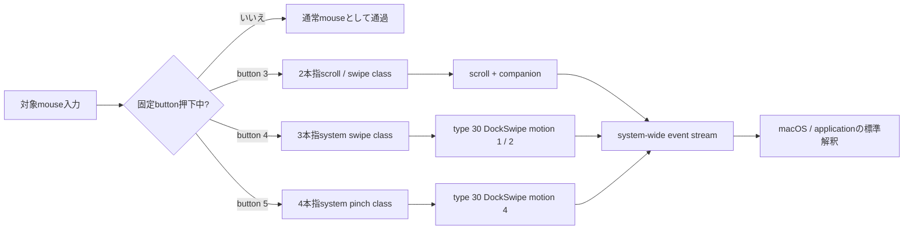

# Nape Gesture

Nape Gestureは、Nape Proなどのmouse入力を、固定buttonに対応するmacOSの上位trackpad gestureへ変換する常駐GUIアプリです。button 3 / 4 / 5を押していない間は、通常mouse入力をそのまま通します。

> **現在の製品状態: 試用可能・Nape Pro主要経路受入済み**
>
> release buildの`/Applications/Nape Gesture.app`をインストールし、現在の署名identityへAccessibility / Input Monitoringを付与してGUI runtimeを稼働中です。Nape Pro実機では3 class合計23 sessionが全て1回ずつ正常終了し、5473 eventをsystem-wideへ生成して作成失敗0件、欠落投稿0件でした。button 4によるSpace切替とMission Control、button 5によるDock system controlの連続遷移を確認し、終了後も通常mouse操作へ復帰しています。現在のmacOS設定ではApp Exposéがオフのため、その画面結果は未確認です。

## 固定操作

buttonとgesture classの対応は製品仕様として固定です。ユーザーがmode、割り当て、感度を変更するものではありません。

| 操作 | 固定GestureClass | ProductOutput |
| --- | --- | --- |
| button 3を押しながらmouseを操作 | 2本指スクロール / スワイプ相当 | type 22 scrollと必要なgesture companion lifecycle |
| button 4を押しながらmouseを操作 | 3本指システムスワイプ相当 | type 30 `DockSwipe`、motion 1 / 2 |
| button 5を押しながらmouseを操作 | 4本指system pinch相当 | type 30 `DockSwipe`、motion 4 |
| button 3 / 4 / 5を押していない | 変換なし | 通常mouse入力をそのまま通過 |

ここでの「2 / 3 / 4本指」はraw digitizer contact数でもgeneric `fingerCount` fieldでもありません。物理trackpad driverがgestureを認識した後に上位へ生成する固定GestureClassを表します。このため、classごとにevent type、field、phase、companion event、単位変換が異なることは必須です。button 5はapplication magnificationではありません。



## 入力保存契約

押下中に受理したmove / wheel sampleは、欠落、重複、coalescing、並べ替えをせず、1 sampleから1つのsource commandを生成します。各commandはX/Y量、符号、source kind、取得timestamp、capture order、session IDを保持します。

source commandと低レベルeventの件数が同じである必要はありません。2本指scroll classでは、1 commandからtype 22 scrollと複数のtype 29 companion eventを1 batchとして生成できます。3本指system swipeはtype 30 `DockSwipe`のaxis、XY motion、progress、終端XY velocityへ、4本指system pinchは同じtype 30でもmotion 4、progress、終端Z velocityへ変換します。class固有encodingは、application別routingやユーザーmodeではありません。

button解放、cancel、kill switch、runtime stop、sleep、device切断、権限喪失、event作成または投稿失敗では、active sessionを一度だけterminalへ収束させます。部分投稿が起きた場合は、未投稿offsetと順序を保持して同じsessionを閉じ、新しいsessionへすり替えません。

対象buttonを押している間はmouseとcursorのQuartz連動を停止するため、元moveをgesture量として使用しても画面上のmouse cursorを移動させません。button解放、cancel、tap中断、runtime停止、出力失敗では連動を必ず復元し、通常のcursor追従へ戻ります。

## 製品経路

現在の製品runtimeは次の一続きの経路です。

```text
CGEventUtilities
  -> FixedGestureInputRecognizer
  -> FixedGestureSessionMachine
  -> FixedGestureProductSessionCoordinator
  -> ProductGestureOutput
  -> system-wide event stream
```

- button 3は`twoFingerScrollSwipe`から`scroll` adapterへ接続する。
- button 4は`threeFingerSystemSwipe`から`DockSwipe` adapterへ接続する。
- button 5は`pinch`から`dockSwipePinch` payloadへ接続し、認識済みtype 30 `DockSwipe`をmotion 4で構成する。
- 水平scrollによるページ移動などは、前面applicationの通常解釈に任せる。
- `NavigationSwipe`を独立したbutton classまたは製品routingとして追加しない。
- eventを対象PIDへ直接投稿せず、AX、keyboard shortcut、application別分岐をfallbackにしない。
- DriverKit、virtual HID、raw digitizer contactを製品出力に使わない。

通常SDKに公開されないevent contractは最小のcompatibility adapterへ隔離します。macOS 26.5.1 / 25F80で収録した正負方向別template fixture `recognized-dockswipe-templates-25F80-v2`、SHA-256 `852c7d0b6e32ced7082ea5c06a65d05971d3868e6a36aaccfd6f422871bc32a6`を検証してtype 30 / IOHID `DockSwipe`を復元します。収録元OS情報はfixture、変換model、template間のprovenance照合にだけ使い、実行中macOSのversion / buildとは比較しません。ID、SHA-256、schema、contract ID、fixture実体のどれかが未知または改変済みなら、3 classすべてを非対応としてevent tapと入力抑制を開始しません。

## GUIと設定

設定ウィンドウは、日常的に確認する「ジェスチャー」と低頻度の「詳細」をtoolbarで分離します。「ジェスチャー」paneではruntime状態、通常mouseへの復帰条件、次の固定対応を読み取り専用で表示します。

- button 3 = 2本指スクロール / スワイプ
- button 4 = 3本指システムスワイプ
- button 5 = 4本指system pinch

buttonごとのmode selector、無効化、感度、方向別binding、application別設定はありません。保存済みの旧modeや調整値はmigration時にcanonical設定から除去し、移行失敗時は原本を保持してruntimeを開始しません。「詳細」paneにはgestureの意味を変更しないcancel条件と対象device条件だけを置き、低レベルの識別条件は開示するまで隠します。変更がある場合だけ「変更を適用」を有効にし、適用時にruntimeを再起動します。「権限とデバイス」にはAccessibility、Input Monitoring、対象device、macOS version / build、output contract / fixture、必須family、runtime状態、fail-closed理由を表示します。メニューバーには文字列`NG`ではなく、accessibility label付きのsystem symbolを表示します。

`.app`内の実行ファイルをterminalから`doctor`として起動した場合、TCC判定はNape Gesture.appではなく実行元terminalまたは親applicationに帰属します。GUI本体の権限とruntime状態は、LaunchServices経由で起動したアプリ内の「権限とデバイスを確認」を正とします。ad-hoc署名を更新した後、権限一覧がONでも拒否される場合は、旧Nape Gesture登録を一覧から削除し、現在の`/Applications/Nape Gesture.app`を再追加してから再起動します。

## 品質保証

日常利用で壊れやすい境界を、製品経路と同じ型・設定・bundleで継続検証します。

| 境界 | 自動検証 |
| --- | --- |
| 入力とsession | 3 classの量、符号、timestamp、capture order、sample順、single terminal、cancel / timeout / sleep / wake後の復帰 |
| ProductOutput | class固有fieldとphase、system-wide配送、部分作成・部分投稿・terminal retry、session不一致、未知OS / fixture改変時のfail closed |
| 設定 | 旧設定の原子的migration、冪等性、不正原本の保持、process間排他、lock file改変拒否、保存失敗後の再試行 |
| GUIとdoctor | 固定mappingの読み取り専用表示、dirty / revert、pane / disclosure、複数device条件保持、起動identityとreadinessの整合 |
| 配布bundle | Debug / Release build、警告のerror化、署名必須検証、署名後改変・symlink destination拒否、LaunchServices起動 |
| メモリ安全性 | Core、ProductOutput、DiagnosticOutputをAddressSanitizer / UndefinedBehaviorSanitizer付きでCI実行 |

CIの成功だけを物理gestureの完成証明にはしません。自動検証は回帰と異常系を塞ぎ、Nape Pro、純正trackpad、TCC、Developer ID配布は対応する実機gateで別に判定します。

## 現在位置

| 領域 | 現在 |
| --- | --- |
| 固定button mapping | 実装済み。button 3 / 4 / 5は固定GestureClassへ直接接続 |
| source sample保存 | exact timestamp、capture order、session ID、sample 1対1 command化を実装済み |
| ProductOutput | `scroll`、`dockSwipe`、`dockSwipePinch`をsystem-wideへ投稿可能。pinchはDockSwipe motion 4 |
| GUI / migration / doctor | 固定mappingへ更新済み。保存失敗時の再試行、process間排他、曖昧な起動identityとinventory失敗の明示まで検証 |
| release `.app` | `/Applications/Nape Gesture.app`へインストール済み。現在のad-hoc署名identityでGUI runtime稼働中 |
| system-test | daemon経由で3本指水平のSpace切替、Mission Control、motion 4の正負両方向をDockが受理済み。App ExposéはmacOS設定でオフ |
| Nape Pro物理受入 | 3 class合計23 session、5473生成event、作成失敗0件、欠落投稿0件。全sessionがsingle terminalで終了し、通常操作へ復帰 |
| 公開配布 | Developer ID署名、公証、stapler、Gatekeeper評価は未完了 |

build、test、GUI起動、direct post smokeだけで製品完成とはしません。Nape Proの主要経路は実機受入済みですが、純正trackpadとの最終比較、異常終了後の復旧、App Exposéの設定依存結果、Developer ID署名と公証を含む公開配布gateは引き続き別に判定します。実収録性能はtap callbackから投稿完了までp95 0.123 ms、p99 0.220 msで基準合格です。

## 完成条件

- button 3 / 4 / 5が固定GestureClass以外へ変更できない。
- 各source sampleの量、符号、timestamp、capture order、session対応を保存する。
- 3 class固有のevent family、field、phase、単位変換を自前fixtureまで追跡できる。
- normally pressed / changed / endedと全cancel経路がsingle terminalへ収束する。
- button未押下時、session終了後、異常停止後に通常mouseへ戻る。
- gesture session中はmouse cursorが移動しない。
- 製品runtimeからsystem-wide以外の配送や診断fallbackへ到達しない。
- fixture不一致、event構築不可、権限不足、対象device不一致では抑制前にfail closedする。
- Nape Proと純正trackpadで低レベルcontract、OS / App結果、体感差を別々に物理受入する。
- 日常利用する配布`.app`について署名、公証、性能、復旧を確認する。

詳細は[ゴール要件](docs/requirements.md)、[完成判定チェックリスト](docs/completion-checklist.md)、[ADR-0049](docs/adr/0049-fixed-button-to-gesture-class-input.md)を参照してください。

## 文書

| 目的 | 文書 |
| --- | --- |
| 製品要件 | [docs/requirements.md](docs/requirements.md) |
| 固定GestureClassの決定 | [ADR-0049](docs/adr/0049-fixed-button-to-gesture-class-input.md) |
| 上位event生成境界 | [ADR-0036](docs/adr/0036-emulate-trackpad-driver-output-events.md) |
| sessionとclock | [ADR-0038](docs/adr/0038-trackpad-output-session-and-monotonic-clock.md) |
| 登録済みfixtureによるProductOutput | [ADR-0043](docs/adr/0043-trackpad-scroll-product-output.md) |
| 完成判定 | [docs/completion-checklist.md](docs/completion-checklist.md) |
| 実機検証 | [docs/verification.md](docs/verification.md) |
| 性能基準 | [docs/performance-baseline.md](docs/performance-baseline.md) |

## ライセンス

event contract、field、状態遷移、係数は、Apple公式資料、Apple OSS、このリポジトリで取得した純正trackpad / Nape Proログから再導出します。第三者プロジェクトのコード、定数、field番号、状態遷移、係数、調整値は取り込みません。リポジトリのライセンスは[LICENSE](LICENSE)を参照してください。
