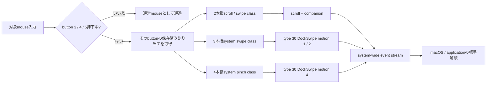

# Nape Gesture

Nape Gestureは、Nape Proなどのmouse入力を、button 3 / 4 / 5ごとに選択したmacOSの上位trackpad gestureへ変換する常駐GUIアプリです。button 3 / 4 / 5を押していない間は、通常mouse入力をそのまま通します。

> **現在の製品状態: button割り当て対応の署名済みRelease候補を試用可能**
>
> 同じRelease候補で、全9 button-class対応、全27割り当てのcanonical round-trip、重複割り当て、選択class基準の感度、GUIの選択・保存・再起動後復元を確認済みです。固定された既定割り当てで取得済みのNape Pro 23 session / 5473 generated eventは、3つのGestureClassと既存ProductOutputの履歴証跡です。既定button以外からのNape Pro物理受入、Developer ID署名、公証を含む公開配布は未完了です。

## button割り当て

button 3 / 4 / 5のそれぞれに、3つのGestureClassから1つをGUIで割り当てます。同じGestureClassを複数buttonへ割り当てられます。各buttonには常に1 classを割り当て、無効または未割り当てにはできません。方向別設定、application別設定、button別感度はありません。

| 対象 | 選択できるGestureClass | 既定値 |
| --- | --- | --- |
| button 3 | 2本指スクロール / スワイプ、3本指システムスワイプ、4本指システムピンチ | 2本指スクロール / スワイプ |
| button 4 | 2本指スクロール / スワイプ、3本指システムスワイプ、4本指システムピンチ | 3本指システムスワイプ |
| button 5 | 2本指スクロール / スワイプ、3本指システムスワイプ、4本指システムピンチ | 4本指システムピンチ |
| button 3 / 4 / 5を押していない | 変換なし | 通常mouse入力をそのまま通過 |

ここでの「2 / 3 / 4本指」はraw digitizer contact数でもgeneric `fingerCount` fieldでもありません。物理trackpad driverがgestureを認識した後に上位へ生成するGestureClassを表します。選択後のProductOutput / event contractは従来どおりclassごとに固定です。

| GestureClass | ProductOutput | システムジェスチャー感度 |
| --- | --- | --- |
| 2本指スクロール / スワイプ | type 22 scrollと必要なgesture companion lifecycle | 適用しない |
| 3本指システムスワイプ | type 30 `DockSwipe`、motion 1 / 2 | 適用する |
| 4本指システムピンチ | type 30 `DockSwipe`、motion 4 | 適用する |

3本指DockSwipeと4本指DockSwipe motion 4はevent family、motion、axis、符号規則を含むencodingが異なります。100%ではsource deltaとsource velocityを`/ 600`で変換し、実際の変換値は`(source / 600) * システムジェスチャー感度倍率`です。感度を適用するかは物理button番号ではなく、session開始時に選択されたGestureClassで決まります。4本指classはapplication magnificationを使いません。



## 入力保存契約

押下中に受理したmove / wheel sampleは、欠落、重複、coalescing、並べ替えをせず、1 sampleから1つのsource commandを生成します。各commandはX/Y量、符号、source kind、取得timestamp、capture order、session ID、source button、session開始時に選択したGestureClassを保持します。session途中の設定変更や別button押下でclassを切り替えません。

source commandと低レベルeventの件数が同じである必要はありません。2本指scroll classでは、1 commandからtype 22 scrollと複数のtype 29 companion eventを1 batchとして生成できます。3本指system swipeはtype 30 `DockSwipe`のaxis、XY motion、progress、終端XY velocityへ、4本指system pinchは同じtype 30でもmotion 4、progress、終端Z velocityへ変換します。class固有encodingは、application別routingやユーザーmodeではありません。

button解放、cancel、kill switch、runtime stop、sleep、device切断、権限喪失、event作成または投稿失敗では、active sessionを一度だけterminalへ収束させます。部分投稿が起きた場合は、未投稿offsetと順序を保持して同じsessionを閉じ、新しいsessionへすり替えません。

対象button downのevent locationをsession固有の絶対cursor anchorとして1回だけ保存し、同じ座標への`CGWarpMouseCursorPosition`が成功してからProductOutputを開始します。各moveではX/Y量、timestamp、capture orderを先にsource commandへ保存し、同じevent tap callback内でanchorへ戻してからGestureClass出力を投稿します。wheelではwarpしません。button解放、cancel、tap中断、kill switch、runtime停止、出力失敗ではanchorを必ず破棄し、通常mouse入力へ戻ります。anchor取得またはwarpに失敗した場合はfallbackせずruntimeをfail closedにします。

## 製品経路

現在の製品runtimeは次の一続きの経路です。

```text
CGEventUtilities
  -> FixedGestureInputRecognizer
  -> FixedGestureSessionMachine
  -> FixedGestureProductSessionCoordinator
  -> ProductGestureOutput
  -> system-wide event stream
```

- 選択された`twoFingerScrollSwipe`は`scroll` adapterへ接続する。
- 選択された`threeFingerSystemSwipe`は`DockSwipe` adapterへ接続する。
- 選択された`pinch`は`dockSwipePinch` payloadへ接続し、認識済みtype 30 `DockSwipe`をmotion 4で構成する。
- 水平scrollによるページ移動などは、前面applicationの通常解釈に任せる。
- `NavigationSwipe`を独立したbutton classまたは製品routingとして追加しない。
- eventを対象PIDへ直接投稿せず、AX、keyboard shortcut、application別分岐をfallbackにしない。
- DriverKit、virtual HID、raw digitizer contactを製品出力に使わない。

対象mouseが複数のHIDインターフェースを公開する場合も、入力監視で開くのは`Generic Desktop / Mouse`インターフェースだけです。同じ物理機器のkeyboard、consumer control、vendor-definedインターフェースは対象device条件に一致しても開かず、gesture入力にも使用しません。`devices --all`だけは診断用に全インターフェースを表示します。

通常SDKに公開されないevent contractは最小のcompatibility adapterへ隔離します。macOS 26.5.1 / 25F80で収録した正負方向別template fixture `recognized-dockswipe-templates-25F80-v2`、SHA-256 `852c7d0b6e32ced7082ea5c06a65d05971d3868e6a36aaccfd6f422871bc32a6`を検証してtype 30 / IOHID `DockSwipe`を復元します。収録元OS情報はfixture、変換model、template間のprovenance照合にだけ使い、実行中macOSのversion / buildとは比較しません。ID、SHA-256、schema、contract ID、fixture実体のどれかが未知または改変済みなら、3 classすべてを非対応としてevent tapと入力抑制を開始しません。

## GUIと設定

設定ウィンドウは、日常的に確認する「ジェスチャー」と低頻度の「詳細」をtoolbarで分離します。「ジェスチャー」paneではruntime状態、通常mouseへの復帰条件、button 3 / 4 / 5のGestureClass割り当て、共通の「システムジェスチャー感度」を編集できます。

- 各buttonのselectorには3つのGestureClassだけを表示する。
- 同じGestureClassを複数buttonで選択できる。
- 無効、未割り当て、結果別action、方向別binding、application別設定は表示しない。

割り当てはcanonical設定`gesture.buttonAssignments.button3` / `button4` / `button5`へ保存します。割り当てがない固定モデルの設定は従来の対応を既定値として補い、旧mode / action keyは現行割り当てへ推測変換せず除去します。「システムジェスチャー感度」は`gesture.systemGestureSensitivity`へ倍率0.25から2.0として保存し、1.0を100%として扱います。3本指または4本指classを選択したsessionだけに同じ倍率を適用し、button別、方向別、application別の感度には分けません。`dragSensitivity`、`wheelSensitivity`などの旧調整値は新しい倍率へ移行しません。移行失敗時は原本を保持してruntimeを開始しません。「詳細」paneにはgestureの意味を変更しないcancel条件と対象device条件だけを置き、低レベルの識別条件は開示するまで隠します。変更がある場合だけ「変更を適用」を有効にし、適用時にruntimeを再起動します。「権限とデバイス」にはAccessibility、Input Monitoring、対象device、macOS version / build、output contract / fixture、必須family、runtime状態、fail-closed理由を表示します。メニューバーには文字列`NG`ではなく、accessibility label付きのsystem symbolを表示します。

`.app`内の実行ファイルをterminalから`doctor`として起動した場合、TCC判定はNape Gesture.appではなく実行元terminalまたは親applicationに帰属します。GUI本体の権限とruntime状態は、LaunchServices経由で起動したアプリ内の「権限とデバイスを確認」を正とします。ad-hoc署名を更新した後、権限一覧がONでも拒否される場合は、旧Nape Gesture登録を一覧から削除し、現在の`/Applications/Nape Gesture.app`を再追加してから再起動します。

## 品質保証

日常利用で壊れやすい境界を、製品経路と同じ型・設定・bundleで継続検証します。

| 境界 | 自動検証 |
| --- | --- |
| 入力とsession | 3 classの量、符号、timestamp、capture order、sample順、single terminal、cancel / timeout / sleep / wake後の復帰 |
| ProductOutput | class固有fieldとphase、system-wide配送、部分作成・部分投稿・terminal retry、session不一致、未知OS / fixture改変時のfail closed |
| 設定 | 3 buttonの割り当て、重複、既定値、共通感度の範囲・旧感度非移行、旧設定の原子的migration、冪等性、不正原本の保持、process間排他、lock file改変拒否、保存失敗後の再試行 |
| GUIとdoctor | 各selectorの3選択肢、重複割り当て、無効選択肢なし、共通感度slider、dirty / revert、pane / disclosure、複数device条件保持、複合HIDのマウスインターフェース限定、起動identityとreadinessの整合 |
| 配布bundle | Debug / Release build、警告のerror化、署名必須検証、署名後改変・symlink destination拒否、LaunchServices起動 |
| メモリ安全性 | Core、ProductOutput、DiagnosticOutputをAddressSanitizer / UndefinedBehaviorSanitizer付きでCI実行 |

CIの成功だけを物理gestureの完成証明にはしません。自動検証は回帰と異常系を塞ぎ、Nape Pro、純正trackpad、TCC、Developer ID配布は対応する実機gateで別に判定します。

## 現在位置

| 領域 | 現在 |
| --- | --- |
| button割り当て | Core / runtime / GUI / migrationを接続済み。全9対応、全27設定round-trip、重複、Release GUI保存・再起動後復元を確認 |
| source sample保存 | exact timestamp、capture order、session ID、sample 1対1 command化を実装済み |
| ProductOutput | `scroll`、`dockSwipe`、`dockSwipePinch`をsystem-wideへ投稿可能。pinchはDockSwipe motion 4 |
| GUI / migration / doctor | 3 selector、canonical割り当て、旧設定の原子的migration、未知値の原本保持、doctor表示を同じbinaryで検証済み |
| release `.app` | ad-hoc署名済みRelease候補でGUI保存・再起動後復元まで確認。公開配布用のDeveloper ID署名と公証は未完了 |
| system-test | 3 classの既存ProductOutputをDockが受理した履歴あり。任意button割り当てとの組み合わせは再検証が必要 |
| Nape Pro物理受入 | 固定された既定割り当てで3 class合計23 sessionを受入済み。選択・重複・保存後のruntime受入は未実施 |
| 公開配布 | Developer ID署名、公証、stapler、Gatekeeper評価は未完了 |

build、test、GUI起動、direct post smokeだけで製品完成とはしません。まず新しい割り当て仕様をCore、runtime、GUI、migration、guard、実機で一貫して再受入します。その後も純正trackpadとの最終比較、異常終了後の復旧、App Exposéの設定依存結果、Developer ID署名と公証を含む公開配布gateを別に判定します。旧固定mappingでの性能値は新しいrelease候補へ自動継承しません。

## 完成条件

- button 3 / 4 / 5のそれぞれで3 GestureClassから1つを選択・保存・復元でき、重複割り当ても保持する。
- 無効・未割り当て、application別、方向別、button別感度を追加しない。
- システムジェスチャー感度が25%から200%、既定100%で、物理button番号ではなく選択された3本指・4本指classへ共通適用される。
- 各source sampleの量、符号、timestamp、capture order、session対応を保存する。
- 3 class固有のevent family、field、phase、単位変換を自前fixtureまで追跡できる。
- normally pressed / changed / endedと全cancel経路がsingle terminalへ収束する。
- button未押下時、session終了後、異常停止後に通常mouseへ戻る。
- gesture session中はmouse cursorが移動しない。
- 製品runtimeからsystem-wide以外の配送や診断fallbackへ到達しない。
- fixture不一致、event構築不可、権限不足、対象device不一致では抑制前にfail closedする。
- Nape Proと純正trackpadで低レベルcontract、OS / App結果、体感差を別々に物理受入する。
- 日常利用する配布`.app`について署名、公証、性能、復旧を確認する。

詳細は[ゴール要件](docs/requirements.md)、[完成判定チェックリスト](docs/completion-checklist.md)、[ADR-0049](docs/adr/0049-fixed-button-to-gesture-class-input.md)を参照してください。

## 文書

| 目的 | 文書 |
| --- | --- |
| 製品要件 | [docs/requirements.md](docs/requirements.md) |
| button別GestureClass割り当ての決定 | [ADR-0049](docs/adr/0049-fixed-button-to-gesture-class-input.md) |
| 上位event生成境界 | [ADR-0036](docs/adr/0036-emulate-trackpad-driver-output-events.md) |
| sessionとclock | [ADR-0038](docs/adr/0038-trackpad-output-session-and-monotonic-clock.md) |
| 登録済みfixtureによるProductOutput | [ADR-0043](docs/adr/0043-trackpad-scroll-product-output.md) |
| 完成判定 | [docs/completion-checklist.md](docs/completion-checklist.md) |
| 実機検証 | [docs/verification.md](docs/verification.md) |
| 性能基準 | [docs/performance-baseline.md](docs/performance-baseline.md) |

## ライセンス

event contract、field、状態遷移、係数は、Apple公式資料、Apple OSS、このリポジトリで取得した純正trackpad / Nape Proログから再導出します。第三者プロジェクトのコード、定数、field番号、状態遷移、係数、調整値は取り込みません。リポジトリのライセンスは[LICENSE](LICENSE)を参照してください。
