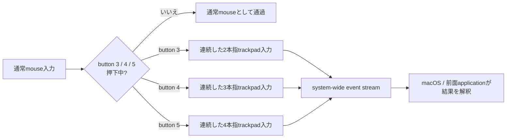

# Nape Gesture

Nape Gestureは、mouse buttonを押している間の連続mouse event量を、固定されたfinger countのtrackpad入力へ変換するmacOS常駐アプリです。button 3 / 4 / 5を押していない間は、通常mouse入力をそのまま通します。

> **現在の製品状態: 未達**
>
> 2026-07-12のbaseline `55eb991`で確認した現行実装には、buttonごとに結果系のmodeを選ぶ、固定製品モデルに反する経路が残っています。固定のbutton→finger count変換はend-to-endで実装・検証されていないため、現在のbinary、GUI、設定、既存テストをこの製品モデルの完成証跡にはできません。

## 製品dashboard

| 領域 | 必須状態 | 現在 |
| --- | --- | --- |
| 固定button対応 | button 3→2本指、button 4→3本指、button 5→4本指 | **未達**。選択式modeの実装が残る |
| 連続入力変換 | 押下中の連続mouse event量を、同じfinger-count sessionの連続量として渡す | **未達**。finger countを正本にしたend-to-end契約がない |
| 通常mouse passthrough | button 3 / 4 / 5未押下時とsession終了後に通常入力を無変更で通す | **一部証跡あり・再検証必須**。固定モデルへの移行後の回帰証跡は未取得 |
| 製品surface | 結果別mode、方向別action、application別設定を持たない | **未達**。button別modeと設定UIが残る |
| 製品配送 | system-wideなtrackpad相当入力だけを使い、AX / PID / shortcut配送を使わない | **境界検証が必要**。診断経路を含めた非到達性の再確認が必要 |
| 低レベルcontract | 2 / 3 / 4本指の物理captureと生成eventをOS buildごとに照合する | **未完了**。既存familyの部分証跡だけではfinger count再現を証明しない |
| OS / App結果 | trackpad入力後の結果をscenario単位で別途確認する | **未完了**。結果はNape Gestureのmodeやactionではない |
| Nape Pro実機 | 実機入力から生成、配送、結果、通常入力復帰まで確認する | **未完了** |
| 配布 | 署名、公証、stapler、Gatekeeper評価を完了する | **未完了** |

このdashboardは、実装が存在することと製品要件を満たすことを分けて表示します。低レベルevent builder、fixture、dry-run、GUI、画面変化のいずれか一つだけで行を「完了」に変更してはいけません。

## 固定操作モデル

buttonとfinger countの対応は製品仕様として固定です。ユーザーがmodeや割り当てを選ぶものではありません。

詳細要件は[ゴール要件](docs/requirements.md)、設計決定は[ADR-0049](docs/adr/0049-fixed-button-to-finger-count-trackpad-input.md)を正とします。

| 操作 | Nape Gestureの入力変換 |
| --- | --- |
| button 3を押しながらmouseを操作 | 連続した2本指trackpad入力 |
| button 4を押しながらmouseを操作 | 連続した3本指trackpad入力 |
| button 5を押しながらmouseを操作 | 連続した4本指trackpad入力 |
| button 3 / 4 / 5を押していない | 通常mouse入力をそのまま通過 |

押下中の移動方向や途中の方向転換は、別actionを選ぶためのcommandではありません。mouse eventの連続量を保ったまま、buttonに対応するfinger countの同一sessionへ渡します。button解放時はsessionを正しく閉じ、通常mouse状態へ戻します。

button→finger count対応を変更する設定、無効化する`none`、結果名で選ぶmode、方向別bindingは製品モデルにありません。対象deviceの識別、権限、diagnostics、安全停止などの運用設定は、この固定対応を変更しない範囲で別レイヤーとして扱います。

有効なsource sampleは欠落、重複、coalescing、並べ替えをせず、X/Y量、符号、timestampを個別に生成eventへ対応付けます。mouse単位とtrackpad単位の差だけを自前fixtureから導出した単一contractで変換し、感度、加速度、dead zone、threshold、clampをユーザー設定または結果別係数として追加しません。

## 通常mouse passthrough

button 3 / 4 / 5のいずれも押していないとき、Nape Gestureは通常mouseの振る舞いを変えません。

- 通常クリック、pointer移動、drag、wheelなどをgesture eventへ変換しない。
- applicationごとに「通常mouseへ戻す」設定を要求しない。
- gesture sessionの終了、cancel、緊急停止、runtime停止後も通常入力を過剰抑制しない。
- passthroughをfallbackや例外動作ではなく、製品の通常状態として検証する。

## レイヤーの分離

Nape Gestureが決めるのは、押下buttonに対応するfinger countと、その連続入力量までです。

| レイヤー | 扱う内容 | 扱わない内容 |
| --- | --- | --- |
| ユーザー操作 | button 3 / 4 / 5、連続mouse event量 | 結果別mode、方向別action、application別割り当て |
| 製品runtime | 2 / 3 / 4本指trackpad入力session、system-wide配送 | AX scrollbar、対象PIDへの直接投稿、keyboard shortcut代替 |
| 低レベル互換層 | event contract、phase、field、fixture、OS build | ユーザー向け機能名、button設定、完成結果 |
| macOS / application | 受け取ったtrackpad入力の解釈と画面結果 | Nape Gestureの設定値としての結果選択 |
| 証跡 | 入力、生成、配送、結果、通常入力復帰の対応付け | 画面が動いたという観察だけの完成判定 |

`scroll`、`DockSwipe`、`NavigationSwipe`、`magnification`は、低レベルevent familyまたは物理captureの観測語彙です。adapter、fixture、analyzer、runtime traceで使用できますが、ユーザーmode、button割り当て、独立した製品機能ではありません。

実際のscroll、navigation、system gesture、拡大縮小などは、macOSまたは前面applicationがtrackpad入力を解釈した結果です。Nape Gestureはapplication別に結果を選択せず、特定結果をAX、PID配送、shortcutで成立させません。

## 現行実装が未達である理由

このREADME更新時点で、現行sourceには固定製品モデルに反する次の実装が残っています。

- `button3Mode`、`button4Mode`、`button5Mode`という選択式設定がある。
- `none`、2本指相当、system swipe相当、pinch相当をユーザーmodeとして扱う。
- modeから`scroll`、`DockSwipe`、`magnification`へ接続するsession coordinatorと、その前提を固定するテストがある。
- 設定UIがbuttonごとのmode選択を公開している。
- button 4を3本指、button 5を4本指として一貫して表現するinput contract、migration、UI、runtime、fixture、end-to-end証跡が揃っていない。

したがって、既存のmode別テストが成功しても、このREADMEの固定製品モデルが完成したことにはなりません。既存の低レベルadapter、capture、fixture、passthrough証跡は再利用できる可能性がありますが、固定finger-count経路から到達し、同じrunの入力・生成・配送・結果へ対応付けられるまで参考資料です。

## 完了条件

次の条件をすべて満たしたときだけ、製品モデルを完成扱いにできます。

- source、設定schema、設定UI、保存済み設定、migrationから選択式button mode、結果別action、方向別binding、application別設定を除去する。
- `ruby scripts/check-product-model-documentation.rb`と`ruby scripts/check-finger-count-product-model.rb`を成功させる。
- button 3 / 4 / 5を2 / 3 / 4本指入力へ固定し、ユーザー設定や旧設定値で変更できないことをテストする。
- 押下開始から解放またはcancelまで、連続mouse event量、timestamp、方向転換、session ID、phase、terminalを保持する。
- button未押下時、session終了後、緊急停止後、runtime停止後の通常click、move、drag、wheel passthroughを実eventで確認する。
- 製品runtimeからAX scrollbar、対象PID投稿、keyboard shortcut代替へ到達しないことをsource boundaryと実行証跡で確認する。
- 純正trackpadの2 / 3 / 4本指captureを、manifest、fixture SHA-256、schema、contract ID、OS version / buildとともに固定する。
- Nape Proの入力量と生成したtrackpad入力を同じrunで照合し、system-wide event streamへの投稿を確認する。
- macOS / applicationの結果を低レベルcontractとは別のscenarioとして確認し、Nape Gestureのmodeやactionとして記録しない。
- 未知OS build、fixture不一致、contract不一致では入力抑制前にfail closedし、診断出力へfallbackしない。
- TCC許可済みの実利用`.app`でend-to-end証跡を取り、通常入力復帰、kill switch、復旧経路、性能基準を確認する。
- Developer ID署名、公証、stapler、Gatekeeper評価まで完了し、配布物と検証対象のidentityを一致させる。
- READMEのdashboard、詳細要件、完成checklist、検証手順、ADR、テスト名が同じ固定モデルを説明する。

## 安全性と証跡

通常SDKで公開されないevent contractは最小のcompatibility adapterへ隔離します。登録済みfixture ID、SHA-256、schema、contract ID、OS version / build、fixture実体が一致しない環境では、入力抑制を開始せずfail closedにします。

製品gesture出力と診断出力はmodule境界で分離します。診断専用の単純event、AX、PID、shortcut経路を、製品fallback、`supported`、完成証跡へ使いません。

完成証跡では、少なくとも次を別々に保存して対応付けます。

- mouse / HID入力と対象device
- 純正trackpad物理captureとfixture
- 製品が生成したeventとdirect post trace
- system-wide captureとtarget log
- macOS / applicationの結果
- session終了、通常入力復帰、kill switch
- 実行binary、bundle identity、repo revision、OS version / build

## 文書導線

製品モデルに関しては、このREADME、[AGENTS.md](AGENTS.md)、[ゴール要件](docs/requirements.md)、[ADR-0049](docs/adr/0049-fixed-button-to-finger-count-trackpad-input.md)が現在の正本です。現行文書はすべて固定button→finger countモデルへ統一し、結果別mode、方向別action、application別設定、buttonごとのevent family割り当てを説明する文書やリンクを残しません。

| 目的 | 文書 | 現在の扱い |
| --- | --- | --- |
| 製品入口・状態dashboard | [README.md](README.md) | 固定button→finger countモデルの正本 |
| エージェント実装規約 | [AGENTS.md](AGENTS.md) | 固定モデル、禁止境界、完成主張の正本 |
| 詳細要件 | [docs/requirements.md](docs/requirements.md) | 固定モデルの詳細な製品要件 |
| 固定モデルの設計決定 | [ADR-0049](docs/adr/0049-fixed-button-to-finger-count-trackpad-input.md) | 固定mappingと連続入力contractの現行ADR |
| 完成判定matrix | [docs/completion-checklist.md](docs/completion-checklist.md) | fixed finger-count経路の層別完成条件 |
| 実機・runtime検証 | [docs/verification.md](docs/verification.md) | 低レベルcontractとOS / App結果を分ける検証手順 |
| 性能基準 | [docs/performance-baseline.md](docs/performance-baseline.md) | 2 / 3 / 4本指経路のlatency / CPU基準 |
| 配布 | [docs/release.md](docs/release.md) | 固定製品モデルの署名・公証・配布条件 |
| ADR索引 | [docs/adr/README.md](docs/adr/README.md) | 現行ADR一覧の入口 |
| 製品・診断出力の分離 | [ADR-0037](docs/adr/0037-separate-product-and-diagnostic-event-output.md) | 診断fallback禁止の境界 |
| captureとmanifest | [ADR-0039](docs/adr/0039-strict-trackpad-event-analysis-and-capture-manifest.md) | fixture・解析証跡の条件 |
| 物理capture | [ADR-0041](docs/adr/0041-physical-capture-readiness-and-fixture-privacy.md) | ready同期と公開fixtureの条件 |

## ライセンス

実装contractとパラメータは、公式資料、OSの公開ソース、このリポジトリで取得した純正trackpad / Nape Proログから再導出します。第三者成果物由来のコード、定数、状態遷移、係数を取り込みません。リポジトリのライセンスは[LICENSE](LICENSE)を参照してください。

第三者プロジェクトのコード、定数、field番号、状態遷移、係数、調整値は取り込みません。
