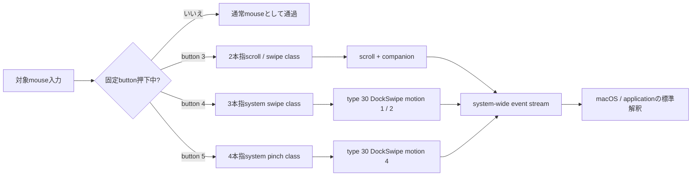

# Nape Gesture

Nape Gestureは、Nape Proなどのmouse入力を、固定buttonに対応するmacOSの上位trackpad gestureへ変換する常駐GUIアプリです。button 3 / 4 / 5を押していない間は、通常mouse入力をそのまま通します。

> **現在の製品状態: 試用可能・物理受入未完了**
>
> release buildの`/Applications/Nape Gesture.app`をインストール済みです。CLI runtimeではbutton 3のscroll lifecycle、button 4のSpace切替、button 5のsystem control `0 → 1 → 0`をevent tapからsystem-wide出力まで確認済みです。再署名後のGUI runtimeはAccessibility / Input Monitoringの再登録待ちです。現在のmacOS設定ではApp Exposéがオフで、残るNape Pro物理受入はbutton 4 / 5の実入力、terminal、解放後passthroughです。

## 固定操作

buttonとgesture classの対応は製品仕様として固定です。ユーザーがmode、割り当て、感度を変更するものではありません。

| 操作 | 固定GestureClass | ProductOutput |
| --- | --- | --- |
| button 3を押しながらmouseを操作 | 2本指スクロール / スワイプ相当 | type 22 scrollと必要なgesture companion lifecycle |
| button 4を押しながらmouseを操作 | 3本指システムスワイプ相当 | type 30 `DockSwipe`、motion 1 / 2 |
| button 5を押しながらmouseを操作 | 4本指system pinch相当 | type 30 `DockSwipe`、motion 4 |
| button 3 / 4 / 5を押していない | 変換なし | 通常mouse入力をそのまま通過 |

ここでの「2 / 3 / 4本指」はraw digitizer contact数でもgeneric `fingerCount` fieldでもありません。物理trackpad driverがgestureを認識した後に上位へ生成する固定GestureClassを表します。このため、classごとにevent type、field、phase、companion event、単位変換が異なることは必須です。button 5はapplication magnificationではありません。



## 入力保存契約

押下中に受理したmove / wheel sampleは、欠落、重複、coalescing、並べ替えをせず、1 sampleから1つのsource commandを生成します。各commandはX/Y量、符号、source kind、取得timestamp、capture order、session IDを保持します。

source commandと低レベルeventの件数が同じである必要はありません。2本指scroll classでは、1 commandからtype 22 scrollと複数のtype 29 companion eventを1 batchとして生成できます。3本指system swipeはtype 30 `DockSwipe`のaxis、XY motion、progress、終端XY velocityへ、4本指system pinchは同じtype 30でもmotion 4、progress、終端Z velocityへ変換します。class固有encodingは、application別routingやユーザーmodeではありません。

button解放、cancel、kill switch、runtime stop、sleep、device切断、権限喪失、event作成または投稿失敗では、active sessionを一度だけterminalへ収束させます。部分投稿が起きた場合は、未投稿offsetと順序を保持して同じsessionを閉じ、新しいsessionへすり替えません。

## 製品経路

現在の製品runtimeは次の一続きの経路です。

```text
CGEventUtilities
  -> FixedGestureInputRecognizer
  -> FixedGestureSessionMachine
  -> FixedGestureProductSessionCoordinator
  -> ProductGestureOutput
  -> system-wide event stream
```

- button 3は`twoFingerScrollSwipe`から`scroll` adapterへ接続する。
- button 4は`threeFingerSystemSwipe`から`DockSwipe` adapterへ接続する。
- button 5は`pinch`から`dockSwipePinch` payloadへ接続し、認識済みtype 30 `DockSwipe`をmotion 4で構成する。
- 水平scrollによるページ移動などは、前面applicationの通常解釈に任せる。
- `NavigationSwipe`を独立したbutton classまたは製品routingとして追加しない。
- eventを対象PIDへ直接投稿せず、AX、keyboard shortcut、application別分岐をfallbackにしない。
- DriverKit、virtual HID、raw digitizer contactを製品出力に使わない。

通常SDKに公開されないevent contractは最小のcompatibility adapterへ隔離します。25F80では正負方向別の認識済みtemplate fixture `recognized-dockswipe-templates-25F80-v2`、SHA-256 `852c7d0b6e32ced7082ea5c06a65d05971d3868e6a36aaccfd6f422871bc32a6`を検証してtype 30 / IOHID `DockSwipe`を復元します。scroll contract、変換model、DockSwipe templateのID、SHA-256、schema、contract ID、OS version / build、fixture実体のどれかが未知または改変済みなら、3 classすべてを非対応としてevent tapと入力抑制を開始しません。

## GUIと設定

GUIは次の固定対応を読み取り専用で表示します。

- button 3 = 2本指スクロール / スワイプ
- button 4 = 3本指システムスワイプ
- button 5 = 4本指system pinch

buttonごとのmode selector、無効化、感度、方向別binding、application別設定はありません。保存済みの旧modeや調整値はmigration時にcanonical設定から除去し、移行失敗時は原本を保持してruntimeを開始しません。対象device条件、cancel時間、診断など、gestureの意味を変更しない運用項目だけを設定対象にします。「権限とデバイス」にはAccessibility、Input Monitoring、対象device、macOS version / build、output contract / fixture、必須family、runtime状態、fail-closed理由を表示します。

## 現在位置

| 領域 | 現在 |
| --- | --- |
| 固定button mapping | 実装済み。button 3 / 4 / 5は固定GestureClassへ直接接続 |
| source sample保存 | exact timestamp、capture order、session ID、sample 1対1 command化を実装済み |
| ProductOutput | `scroll`、`dockSwipe`、`dockSwipePinch`をsystem-wideへ投稿可能。pinchはDockSwipe motion 4 |
| GUI / migration / doctor | 固定mappingへ更新済み。旧modeを製品surfaceへ公開しない |
| release `.app` | `/Applications/Nape Gesture.app`へインストール済み。再署名後のGUI TCC再登録待ち |
| system-test | daemon経由で3本指水平のSpace切替とmotion 4の正負両方向をDockが受理済み。App ExposéはmacOS設定でオフ |
| Nape Pro物理受入 | button 4 / 5が**未完了**。実入力から生成、terminal、解放後passthroughを確認する必要あり |
| 公開配布 | Developer ID署名、公証、stapler、Gatekeeper評価は未完了 |

build、test、GUI起動、direct post smoke、system-testのDock受理だけで製品完成とはしません。残るNape Pro button 4 / 5と純正trackpadの物理操作を同じOS buildで収録し、source、生成event、system-wide配送、画面結果、terminal、通常入力復帰を対応付けて初めて物理受入を完了します。

## 完成条件

- button 3 / 4 / 5が固定GestureClass以外へ変更できない。
- 各source sampleの量、符号、timestamp、capture order、session対応を保存する。
- 3 class固有のevent family、field、phase、単位変換を自前fixtureまで追跡できる。
- normally pressed / changed / endedと全cancel経路がsingle terminalへ収束する。
- button未押下時、session終了後、異常停止後に通常mouseへ戻る。
- 製品runtimeからsystem-wide以外の配送や診断fallbackへ到達しない。
- 未知OS build、fixture不一致、権限不足、対象device不一致では抑制前にfail closedする。
- Nape Proと純正trackpadで低レベルcontract、OS / App結果、体感差を別々に物理受入する。
- 日常利用する配布`.app`について署名、公証、性能、復旧を確認する。

詳細は[ゴール要件](docs/requirements.md)、[完成判定チェックリスト](docs/completion-checklist.md)、[ADR-0049](docs/adr/0049-fixed-button-to-finger-count-trackpad-input.md)を参照してください。

## 文書

| 目的 | 文書 |
| --- | --- |
| 製品要件 | [docs/requirements.md](docs/requirements.md) |
| 固定GestureClassの決定 | [ADR-0049](docs/adr/0049-fixed-button-to-finger-count-trackpad-input.md) |
| 上位event生成境界 | [ADR-0036](docs/adr/0036-emulate-trackpad-driver-output-events.md) |
| sessionとclock | [ADR-0038](docs/adr/0038-trackpad-output-session-and-monotonic-clock.md) |
| 25F80 ProductOutput | [ADR-0043](docs/adr/0043-trackpad-scroll-product-output.md) |
| 完成判定 | [docs/completion-checklist.md](docs/completion-checklist.md) |
| 実機検証 | [docs/verification.md](docs/verification.md) |
| 性能基準 | [docs/performance-baseline.md](docs/performance-baseline.md) |

## ライセンス

event contract、field、状態遷移、係数は、Apple公式資料、Apple OSS、このリポジトリで取得した純正trackpad / Nape Proログから再導出します。第三者プロジェクトのコード、定数、field番号、状態遷移、係数、調整値は取り込みません。リポジトリのライセンスは[LICENSE](LICENSE)を参照してください。
