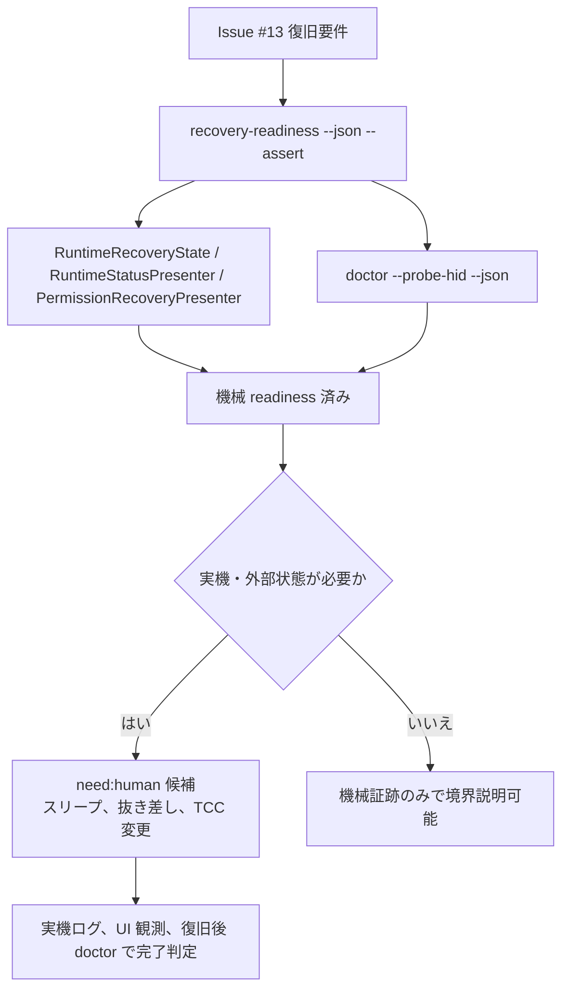

# Runtime recovery readiness

Issue #13 のスリープ復帰、対象デバイス抜き差し、TCC 権限変更後復旧は、状態機械だけで完了判定しない。
先に機械で固定できる契約を `recovery-readiness` で構造化し、最後に必要な実機・外部状態の証跡を同じシナリオ名で収集する。

## コマンド

```sh
.build/debug/nape-gesture recovery-readiness --json --assert
.build/debug/nape-gesture recovery-readiness --markdown --assert
```

`--assert` は次を検査する。

- `schemaVersion: 1` と `reportKind: "runtimeRecoveryReadiness"` を維持する
- Issue #13 の主要シナリオを落とさない
- `need:human` の境界を明示する
- 実機・外部状態の証跡が残るシナリオを `completed` にしない
- 各シナリオに機械証跡、機械 assertion、残る外部証跡を持たせる

completion evidence では、常に `NAPE_COMPLETION_ARTIFACT_ROOT/recovery-readiness/` 配下へ保存する。

```text
$NAPE_COMPLETION_ARTIFACT_ROOT/recovery-readiness/recovery-readiness.json
$NAPE_COMPLETION_ARTIFACT_ROOT/recovery-readiness/recovery-readiness.md
```

`NAPE_COMPLETION_ARTIFACT_ROOT` を指定しない場合の既定 root は `artifacts/completion/<日付>/machine-evidence` なので、既定では `artifacts/completion/<日付>/machine-evidence/recovery-readiness/` になる。
個別 PR で root を `artifacts/completion/<日付>/runtime-recovery-readiness` に変えた場合は、同じ規則で `artifacts/completion/<日付>/runtime-recovery-readiness/recovery-readiness/` を見る。

## シナリオ

| ID | 機械で固定すること | 残る外部証跡 |
| --- | --- | --- |
| `sleep-wake-runtime-retry` | スリープ前停止、スリープ中 retry 抑止、wake 後遅延 retry | 実 Mac のスリープ復帰ログ、常駐 UI 観測、復帰後の `doctor --probe-hid` |
| `target-device-disconnect` | `targetDevice.notFound` の診断、自動再試行対象、matcher 不足の再試行禁止 | 実デバイス抜線時の runtime ログ、対象不在 UI、通常入力 target log |
| `target-device-reconnect` | pending retry の消費、手動停止尊重、HID probe を runtime ready 前提にする | 再接続後の HID inventory 差分、runtime 再開ログ、gesture / normal input target log |
| `accessibility-permission-change` | アクセシビリティ未許可時の導線、付与対象、再起動案内 | TCC 変更後の `doctor --json` 差分、System Settings 上の許可対象、再起動後 runtime ready |
| `input-monitoring-permission-change` | 入力監視未判定と未許可の区別、HID probe failure code、remediation | 入力監視 TCC 変更後の HID probe、System Settings 上の許可対象、再起動後 runtime ready |
| `recoverable-runtime-failure` | 一時的な event tap / HID / target 不在の自動再試行 | 実 runtime の一時失敗ログ、復旧後 target log |
| `human-fix-required-failure` | 設定不正や matcher 未設定を無限再試行しない | 設定 UI または config 修正後の再実行ログ |

## 判定フロー



## `need:human` 境界

`need:human` はレビュー待ちや判断待ちには使わない。
実デバイス抜き差し、Mac スリープ復帰、TCC 変更、ログイン資格情報、ユーザー判断など、人が実際に作業しないと進まない場合だけ使う。

System Settings の表示や GUI 操作は computer-use を優先する。
ただし、TCC 許可の最終変更や物理デバイス操作を自動化できない場合は、人間作業として Issue / PR に明記する。

## 完了扱いにしない条件

次の状態では Issue #13 を close しない。

- `recovery-readiness --json --assert` だけが成功している
- core tests と `doctor` だけが成功している
- スリープ復帰、抜き差し、TCC 変更の実ログがない
- 常駐 UI の自動再試行表示と復旧後 `doctor` の対応が保存されていない

この文書と `recovery-readiness` は、人間作業を減らすための前段証跡であり、実機・外部状態の最終証跡を代替しない。
